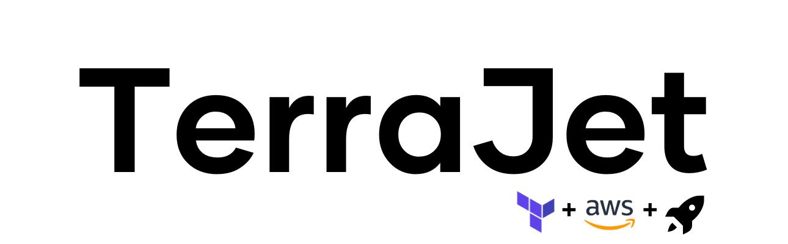

<h2>Built For Your Monolith</h2>

TerraJet follows [AWS][aws] best practices to help your infrastructure archives reliability, security, performance, and cost optimization. Save your time on researching and deploying. TerraJet provide the easiest way to approach Infrastructure as Code (IaC) frameworks like Terraform.

&nbsp;
&nbsp;
&nbsp;
&nbsp;


**Table of Contents**
- [🌱 Features](#-features)
- [🏗 Design Diagram](#-design-diagram)
- [📦 Provided Modules](#-provided-modules)
- [🛠 Installation](#-installation)
- [🧹 Cleanup](#-cleanup)
- [📌 Extra step for Production](#-extra-step-for-production)
- [❔ FAQ](#-faq)
	- [Q: Why ECS is used for monolith app?](#q-why-ecs-is-used-for-monolith-app)
	- [Q: Why is ECS but not Kubernetes?](#q-why-is-ecs-but-not-kubernetes)

## 🌱 Features
- Support deploying Single-page application (React, Angular, Vue) to S3 and cached by CloudFront.
- Support deploying SQL database to RDS.
- Support deploying and automatic scaling **Dockerized** API to ECS cluster.
- Enable Role-Based Access Control for API app.
- Enable spot instance mode in ECS to save computing cost.
- Provide TLS/SSL certificate with ACM
- Provide Microservices adaptability for your future growth.

## 🏗 Design Diagram


## 📦 Provided Modules
These AWS Terraform modules are provided by current version.

| Name                   | Description                       |
| ---------------------- | --------------------------------- |
| [IAM][iam]             | Identity and Access Management    |
| [Policy][plc]          | IAM Policy                        |
| [VPC][vpc]             | Virtual Private Cloud             |
| [SecurityGroup][sg]    | Security Group                    |
| [S3][s3]               | S3                                |
| [CloudFront][cf]       | CloudFront                        |
| [RDS][rds]             | Relational Database Service (RDS) |
| [KeyPair][kp]          | EC2 KeyPair                       |
| [EC2][ec2]             | EC2                               |
| [ECR][ecr]             | Elastic Container Registry        |
| [ECS][ecs]             | Elastic Container Service         |
| [ELB][elb]             | Elastic Load Balancer             |
| [Logs][lgs]            | CloudWatch Logs                   |
| [Route53][r53]         | Route 53                          |
| [Route53 Record][r53r] | Route 53 Record                   |
| [ACM][acm]             | AWS Certificate Manager           |

[aws]: https://aws.amazon.com/
[iam]: ./modules/iam
[plc]: ./modules/policy
[vpc]: ./modules/vpc
[sg]: ./modules/security-group
[s3]: ./modules/s3
[cf]: ./modules/cloudfront
[rds]: ./modules/rds
[kp]: ./modules/keypair
[ec2]: ./modules/ec2
[ecr]: ./modules/ecr
[ecs]: ./modules/ecs
[elb]: ./modules/loadbalancer
[lgs]: ./modules/logs
[r53]: ./modules/route-53
[r53r]: ./modules/route-53-record
[acm]: ./modules/acm

## 🛠 Installation
This instruction can be used for **all environments** with **Development (Dev) environment** as an example.
1. Install Terraform, AWS CLI, Docker to your machine.
2. Create AWS account and bind credit card.
3. Prepare a domain.
4. Create IAM user with **AdministratorAccess** policy and save AWS credentials to local machine with **aws-terrajet-dev** profile name
5. Set up environment variables in *envs/dev.tf*
6. Create 2 ssh keys for ECS and EC2 bastion
	```
	ssh-keygen -t ed25519 -f ~/.ssh/terrajet_dev_ecs
	ssh-keygen -t ed25519 -f ~/.ssh/terrajet_dev_bastion
	```
7. Clone **template.secrets.env.yaml** secret template in **/secrets** folder with name **secrets.dev.yaml**
8. Update RDS username, password and public key of 2 ssh keys created above to **secrets.dev.yaml**
9. Run `terraform init`
10. Run `terraform apply`, then type `'yes'`
11. Update information of created services in **Output** section to domain provider and deploy section.

	```
	api_domain = "<your-domain>"
	bastion_dns = "<url>"
	db_endpoint = "<url>"
	ecr_repository_urls = {
	"api" = "<url>"
	}
	route_53_ns = tolist([
	"<ns>",
	"<ns>",
	"<ns>",
	"<ns>",
	])
	s3_web_app_bucket_name = "terrajet-dev-static-web-app"
	```
	1. Update Route53 NS to your domain provider.
	2. Go to **/apps** folder and update **deploy.sh** file with above values.
12. Go to **/apps** folder and run **deploy.sh** to deploy API and web app
13. Access your **'domain'** and **'api.domain'** URL to check the app is running.

## 🧹 Cleanup
1. Run `terraform destroy`, then type `'yes'`
2. Delete your AWS account.

## 📌 Extra step for Production
- Move your Terraform state to safe backend like S3 or Terraform Cloud

## ❔ FAQ
### Q: Why ECS is used for monolith app?
Deploying an app on AWS using EC2 is a commonly used and straightforward approach. However, it can be challenging to maintain and scale, particularly when working with Docker containers. On the other hand, ECS cluster may appear more complex at first glance, but it actually simplifies the process. With ECS, you leave all the container control tasks for it, allowing you to focus on your code.
### Q: Why is ECS but not Kubernetes?
Although Kubernetes is popular and strongest for container clusters, but it's not necessary for our regular workload. It's resource-intensive and better suited for large-scale projects with a dedicated DevOps team. ECS is simpler and suitable for small to medium-sized monolithic apps.
