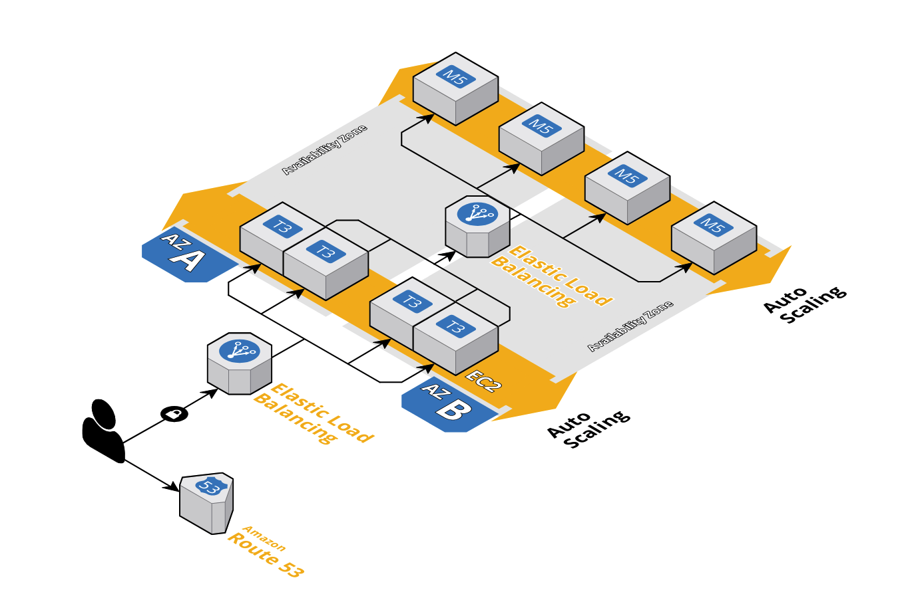

# Terraform AWS Template

 This template is built to help you provision AWS services that you need for your monolith web application with back-end and Database on EC2 and front-end on S3 and CloudFront on [AWS](https://aws.amazon.com/).

## Supported Services

These AWS services are supported by current version.

| Name                | Description           |
| ------------------- | --------------------- |
| [VPC][vpc]          | Virtual Private Cloud |
| [SecurityGroup][sg] | Security Group        |
| [S3][s3]            | S3                    |
| [CloudFront][cf]    | CloudFront            |
| [EC2][ec2]          | EC2 Instance          |
| [Route53][r53]      | Route 53              |

### Components

These components are shared by all environments.

| Name              | Description                   | Optional |
| ----------------- | ----------------------------- | :------: |
| [provider.tf][mp] | AWS provider                  |          |
| [main.tf][mm]     | AWS provider, output          |          |
| [outputs.tf][mo]  | Output variables after deploy |          |  |

[aws]: https://aws.amazon.com/

[vpc]: ./modules/vpc
[sg]: ./modules/vpc
[s3]: ./modules/vpc
[cf]: ./modules/vpc
[ec2]: ./modules/vpc
[r53]: ./modules/vpc

[mp]: ./provider.tf
[mm]: ./main.tf
[mo]: ./outputs.tf