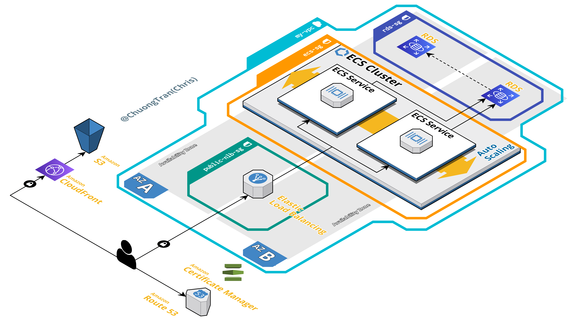

<h1 style="text-align: center;">Built For Your Monolith</h1>

#### This template is built to help you provision [AWS](https://aws.amazon.com/) services that you need for your monolith web application. Save your time on researching and deploy infrastructure with IaC tool like Terraform.
## Features:
- Support deploying Single-page application (React, Angular, Vue) to S3 and cached by CloudFront.
- Support deploying and scaling **Dockerized** API to ECS cluster.
- Support deploying SQL database to RDS.
- Provide TLS/SSL certificate with ACM
- Provide Microservices adaptability for your future growth.

## Supported modules

These AWS Terraform modules are supported by current version.

| Name                | Description           |
| ------------------- | --------------------- |
| [VPC][vpc]          | Virtual Private Cloud |
| [SecurityGroup][sg] | Security Group        |
| [S3][s3]            | S3                    |
| [CloudFront][cf]    | CloudFront            |
| [RDS][rds]          | RDS                   |
| [EC2][ec2]          | EC2 Instance          |
| [Route53][r53]      | Route 53              |

[aws]: https://aws.amazon.com/

[vpc]: ./modules/vpc
[sg]: ./modules/security-group
[s3]: ./modules/s3
[cf]: ./modules/cloudfront
[rds]: ./modules/rds
[ec2]: ./modules/ec2
[r53]: ./modules/route-53

[mp]: ./provider.tf
[mm]: ./main.tf
[mo]: ./outputs.tf
